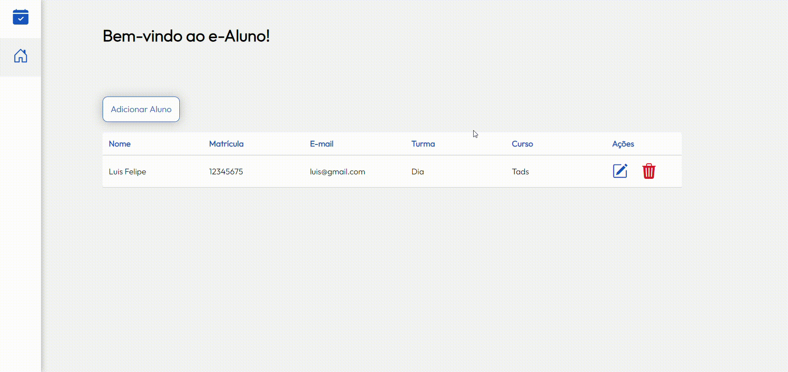

# Sistema de Cadastro de Alunos

Bem-vindo ao repositório do Sistema de Cadastro de Alunos! Este projeto é um sistema completo de CRUD (Create, Read, Update, Delete) para gerenciar o cadastro de alunos. O front-end é desenvolvido com JavaScript, HTML e CSS, enquanto o back-end utiliza Java com o framework Quarkus.

## Índice

- [Sobre o Projeto](#sobre-o-projeto)
- [Tecnologias Utilizadas](#tecnologias-utilizadas)
- [Demonstração em Vídeo](#demonstração-em-vídeo)

## Sobre o Projeto

Este sistema permite realizar as quatro operações básicas de um CRUD para o gerenciamento de alunos. As funcionalidades incluem:

- Criação de novos cadastros de alunos
- Leitura de informações dos alunos cadastrados
- Atualização de informações dos alunos
- Exclusão de cadastros de alunos

## Tecnologias Utilizadas

### Front-end

- **JavaScript**
- **HTML**
- **CSS**

### Back-end

- **Java**
- **Quarkus** (Framework)

## Demonstração em Vídeo

Para uma visão rápida de como o sistema funciona, assista ao vídeo abaixo:

[![Demonstração do Sistema de Cadastro de Alunos]

